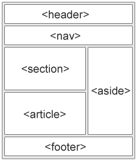

# 5. Semantic tags - Page Sections
Created Wednesday 17 June 2020

* We have header, footer and navigation.

We use the following layout

The 5 semantic (fixed type of content is not fixed) tags:

* header - for headings, dates, name etc
* nav - for links to other pages
* main
	* section - encloses like content
	* article - a standalone article, part of no section
* aside - side links, appendix
* footer - site footer

