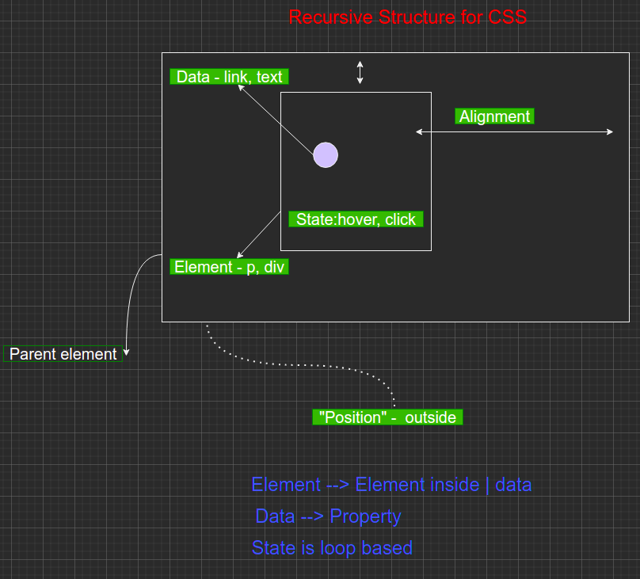

# 1. CSS Basics
Created Sunday 25 April 2021

* The basic structure of CSS is very simple.
* But there are lots of useful combinations. Consequently, lots of properties and values emerge.
* CSS cannot be memorized - it's too big. Better learn the basics and use MDN for names.

See [Drawio mindmap.](./1._CSS_Basics/css_mindmap) Here's the image.

