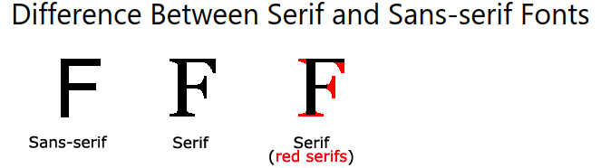

# 4. Fonts
Created Tuesday 16 June 2020

1. font-family: defines **boldness**, size and style.

CSS font families:

1. Generic family: serif or monospace or sans-serif
2. font-family: a specific family viz apple, Arial, Times New Roman

* **Sans-serif are considered much easier to read on screens**

Note: 

1. For multi-worded families, use double quotes.
2. More than one fonts can be seperated by commas. Leftmost is used, if available.

*****

1. font-style: normal, italic or oblique
2. font-weight: normal or bold
3. font-variant: normal or small caps(makes everything uppercase but height is preserved)
4. font-size: kpx; // shouldn't be used for headings, as we have h1 to h6 for them, decreasing.

*****

Using combination of em and px;
	body { font-size: 100%; }
	h1 { font-size: 2.5em; }
	p { font-size: 0.875em; }

* We can also specify font w.r.t the view port: 10**vw** - This allows for the text to scale as the window width changes. 1 vw = view_port_length/100

*****

Google font provides the link tag

