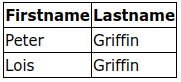
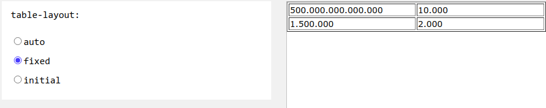

# 5. CSS tables
Created Tuesday 16 June 2020

* Specify borders
* border-collapse: collapse; for the table element makes a single 

* For dividers its better to set up th and td, rather than tr, this way we don't need to manage the rows seperately and can shift cells if required. tr is only for keeping them together.
* :hover pseudo class can be used to give focus for the cursor.
* **striped table**, using nth-child(even) psuedo element
* Responsive web table: the scroll bar appears only for the table - wrap it in a container and set **overflow-x: auto;**
* We can set the column widths, using **table-layout**: auto, fixed or initial

