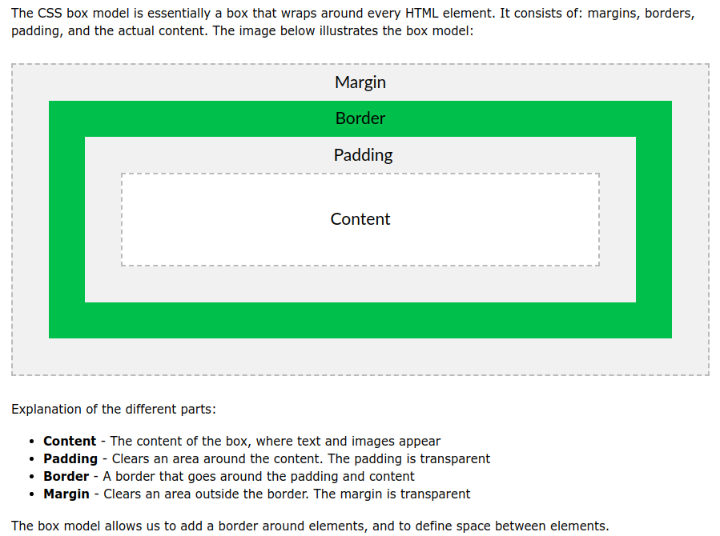
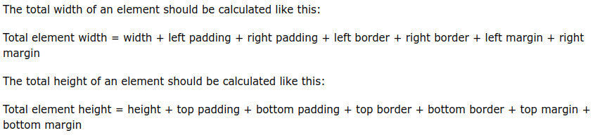

# 1. Box model
Created Tuesday 16 June 2020

* Every element is considered a box in CSS

* Width, height are for the content. Padding, border and margin are calculated seperately.

* If there was an eventListener, it would activate only within the border(inclusive).

