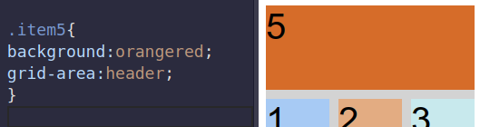

# 5. Naming items
Created Thursday 03 September 2020

* We can name item by using grid-template-areas
* Empty names are designated using perid(.)
* All other names are standard C++ variable names

Syntax:
	.container
	{
	grid-template-areas:
	  "header header header"
	  "advert content content"
	  "footer footer footer"; // creates a 3x3 named grid
	}
	
	.item
	{
	  grid-area:;
	}

*****

**Naming/Using the items**
Steps:

1. Select an existing selector
2. Set **grid-area** to name of the template
3. Write the styles

e.g Here the first 3 cells were marked header

*****

We can use the areas even without naming them: Just specify the 4 lines enclosing them, separated by slashes. ACW from top.

