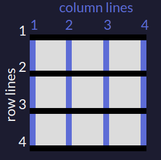
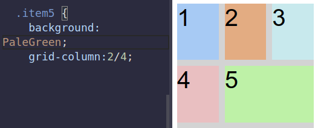

# 1. Space occupied
Created Thursday 03 September 2020

First: Undertand how grid is represented

* Like a matrix
* 1 based indexing

*****

**Set the postions**
There are two options:

1. grid-row: a/b; // occupies rows from line a to b 
2. grid-column:a/b; // occupies column from line a to b

* the row and column are independent
* If you feel confused, start with grid-row: n/n+1;

e.g

*****

* All other grid items are wrapped accordingly.

