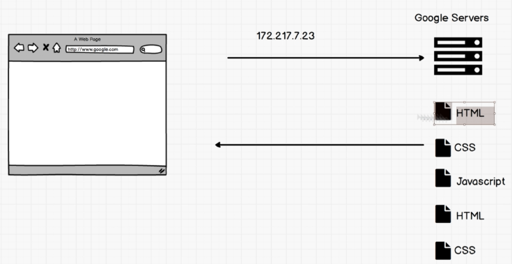
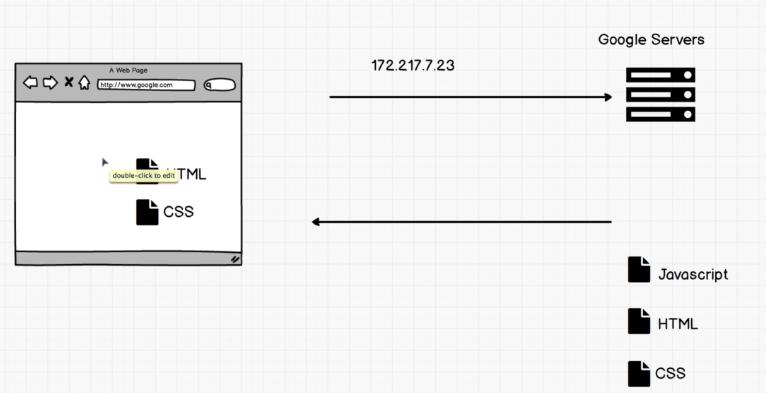
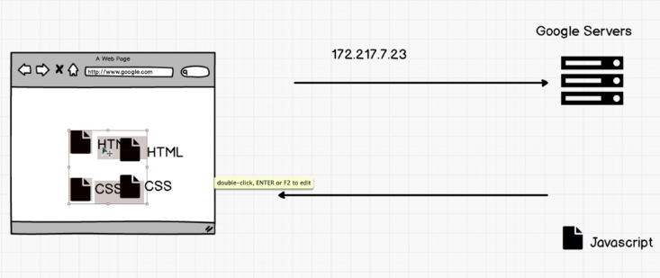
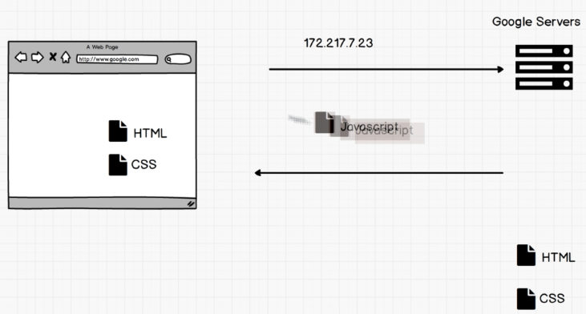

# 2. DOM Manipulation
Created Friday 10 July 2020

* Up until now, we've been writing HTML, CSS and using JS to control effects on the page, but not really.
* Using JS we can change everything from HTML elements, attributes to CSS effects on the page. This is truly a power.

*****

Powers of JS include:

* change any HTML element, attribute in a page.
* change any CSS styles on a page.
* remove existing HTML elements and attributes
* add new HTML elements and attributes
* JavaScript can create/edit/delete HTML *events *for any element in a page

*****

We could do some of the changes even without JS, just by using new HTML and CSS files.
e.g 
 
Load the index.html

**Option A**

Need about.html

Send about.html
This increases the latency(4x transit time) and therefore hampers user experience.
**Option B**
We just keep the instructions to change the html page, by just sending the JS. This reduces the data flow. No extra CSS or JS files are required. 

* **More interactive websites.**

*****

To do all this, we need understand two things:

1. DOM
2. JS engine

