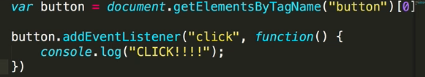

# 3. DOM events
Created Sunday 12 July 2020

* JS can be used to listen to events and do something. Events include hovering, clicking, writing, key-press, copy, paste etc.
* How to listen to events - attach an event listener(to some element).

	eObj.addEventListener('click', f);	// click is the event, f is the action
	
	// f recieves the event automatically as first argument

* More than 95% of the events are keypress and mouse events.

1.' click'

2. 'keypress', event.which = 13 for enter(ASCII code)
3. 'mouseover'
4. 'mouseout'
5. 'input' - triggered when value of the element changes

* MAID - all eventListeners are in an **event-while** loop structure separate from the remaining code(which we assume has already run, because code is much **faster** than physical events)
* This is the reason why **caching** elements is so important, for relevant stuff, this makes it so easy and efficient.

#### Three event parameter
The callback function can have a parameter which is set by JS once the event occurs. Some important attributes of this ``event`` parameter are:

1. tagName - returns tag name in all caps, a string.
2. target - returns the host object

