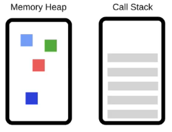
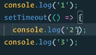
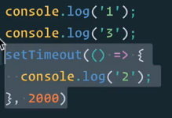
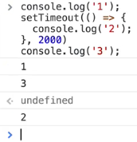
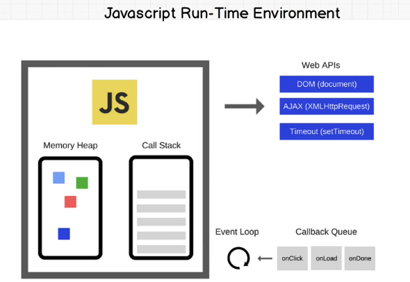

# 10. How Does JS works
Created Saturday 18 July 2020

* We don't need to know how JS is implemented, but we do need to know how it works.

Sample Interview questions:

* How does JS actually work?
* Explain asynchronous vs synchronous.
* JS is single threaded that can be non-blocking, explain.

*****

There are two basic mechanisms in a computer:

1. **Memory Heap** - Memory is limited, so we need a garbage collector - To avoid memory leaks(unused memory) - This is why global variables are discouraged.
2. **Call stack** - This is used to control the program flow, including recursion. Including function removal after execution.

* Stack overflow - There's no space to include new activation records.

*****

* What does single threaded mean? - JS has only one call stack. It is simple to implement as compared to multi-threaded. No deadlocks can occur.
* Synchronous - Code is run line by line. 
* Synchronous can be problematic if a function takes too much time, e.g API calls, content load etc. This is also referred to as **blocking**.

*****

Asynchronous helps us tackle potentially blocking LOC.
How to program asynchronous?

1. Using a timeout for the blocking sections of the code.

 > 

*****

JavaScript Run-Time Environment

* In addition to the JS engine, we have Web APIs(like DOM, AJAX etc), a callback queue and an event loop. All this is referred to as the environment.

* timeout is provided by the browser.

How did the code run:

1. console.log('1') got executed by the call stack.
2. The next line was a timeout, so Timeout API waited for 2 second, we were then ready to run the code.
3. The timeout code was sent to the Callback-queue(which is a queue of processes ready to run)
4. The event loop actually keeps on checking if the call stack is empty, and if it pops a process from the callback queue to the call stack.
5. During these 2 second, the call stack ran the code below line by line.

* Event listeners are persistent functions in the callback queue.

*****

Practial examples of asynchronous:

1. **Synchronous** - We call a teacher and wait for the teacher to pick up and answer, but do noting while their phone is ringing. **Asynchronous** - We text the teacher and keep doing our work. The teacher responds when they are free.
2. Reading files, network requests.

