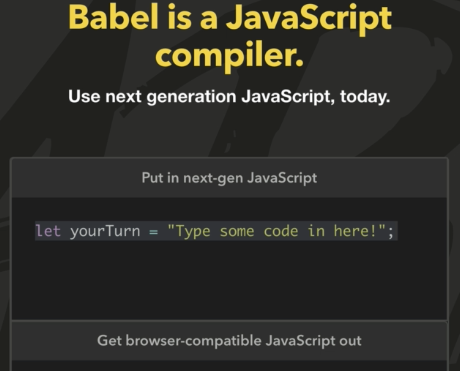
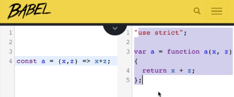

# 2. ES5 and ES6
Created Tuesday 14 July 2020

#### About the JS ecosystem
**"There is nothing static about being a web-developer, everything is improving".**

* HTML, CSS are JS evolving very rapidly.
* Even browsers are being updated.
* New libraries are made, existing ones are being improved.

* Now formally called ECMAScript, it interchangeably used with JavaScript.
* ES5 and ES6 introduced new features which make coding very easy and fun.

#### ECMAScript standards and compatibility

* **Not all browsers support ES5 and ES6 right now, is it practical to learn and use the standard right now?**
* Yes, some new features of ESx are not currently supported by all browsers. But we can still use them, we'll use a **compiler** to obtain the most supported version of ECMAScript from the latest ESx code. A popular compiler is **Babel**, it works with the latest ESx. **Don't worry about the version.**
* There are two important operations when handling two versions:
	1. Polyfilling - Representing new *functionality* in old code. No syntax changes should be present between new and old. Only functionality changes.
	2. Transpiling - There are new *syntax* changes, and the current code needs to be represented in old syntax. Functionality does not matter here.
* Babel does both transpiling and polyfilling.

 

* The new standards have made the code clean and concise.

#### Features of ES5 and ES6
There are 3 kinds of features introduced by ES5 and ES6:

1. [Necessities](./2._ES5_and_ES6/A._Necessities.md) - critical problems with JS
2. [Shorthands and object features](./2._ES5_and_ES6/B._Shorthands_and_object_features.md) - make code concise and dynamic.
3. [Exclusive features](./2._ES5_and_ES6/C._JS_exclusive_features.md) - new features exclusive to JS

