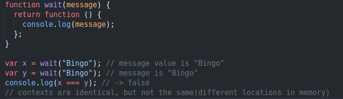

# 2. Closures
Created Thursday 25 March 2021

TODO - somewhat OK. Understand binding in arrow functions.

* **Closure** - a function bundled with references to its surrounding state(the lexical environment). 
* Simply put - a highly impure function.
* Purpose - create secure counters.
* Why secure - a closure behavior depends on the environment.

* Closures help us avoid global variables, and they are very useful.
* The outer function is used only once.

