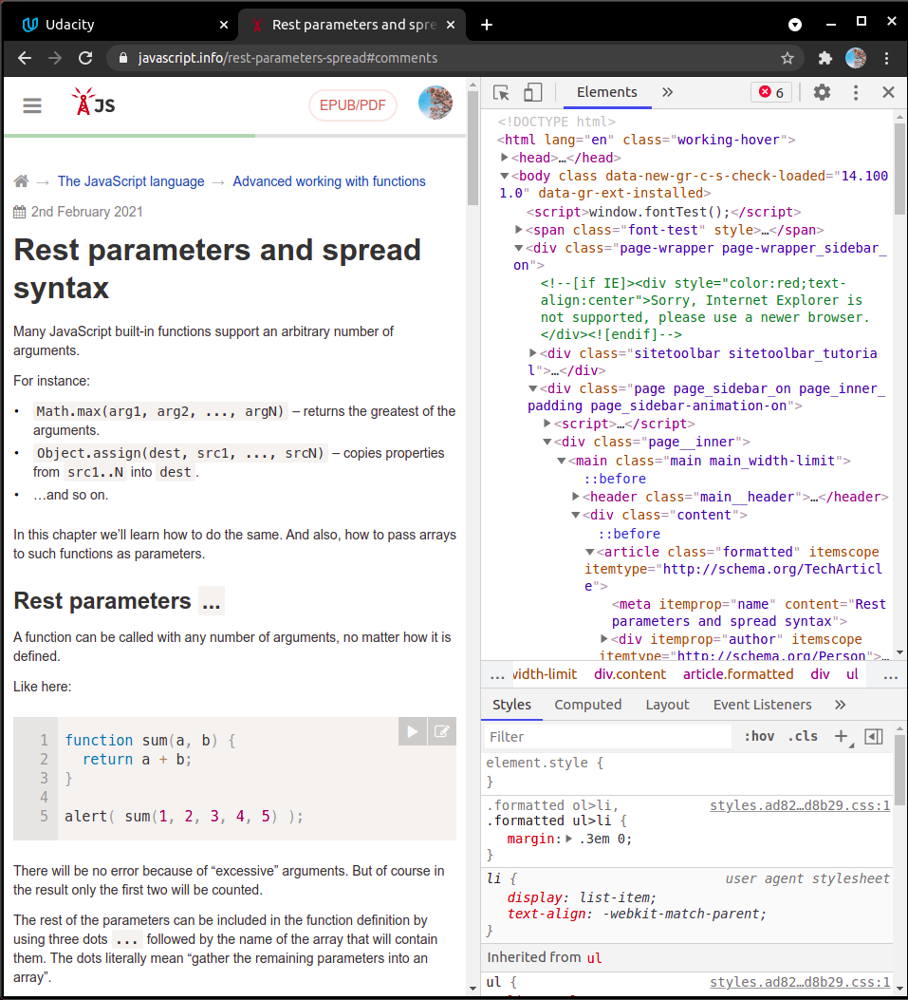
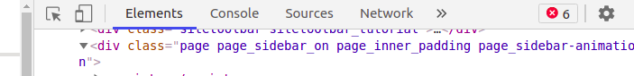
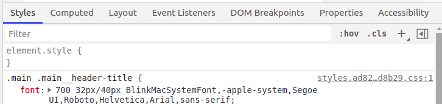
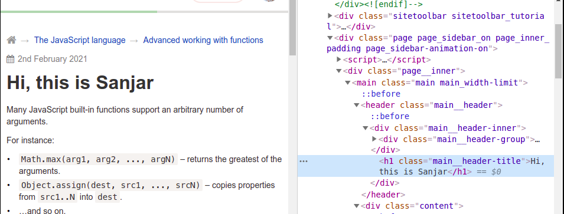

# 2. Dev Tool
Created Saturday 27 March 2021

#### Dev Tool
- This is a tool available in every modern browser.
- To open it, click: Sandwich button → More Tools → Developer tools
- Shortcut: `Ctrl` + `Shift` + `I`

#### What does it do?
- It is used to see:
  - Files sent by the server
  - Track website performance
  - Track network requests
  - See security profile of the website

And more

- For now, we will just play around with websites we see.

#### Playing around with a page
- You can edit the files - HTML, CSS and JS. Changes are rendered instantly.
- To edit HTML, click on the 'Elements tab'.

- To view/edit CSS, click on the 'styles' section. This generally on a different bar than the 'Elements' tab.

- An example, select the element selector button and click on an element(on the page). You'll be shown the corresponding code. Double click to edit.

- Refresh the website to reset changes.

#### How does the Dev Tool work
- We are just editing the recieved files.
- No changes are actually made on the server.
