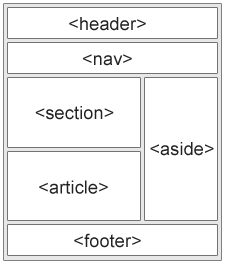

# 5. Semantic tags - Page Sections
Created Wednesday 17 June 2020

- We have header, navigation, content tags and footer. The layout is like this:
  
  The 7 semantic (fixed type of content is not fixed) tags:
1. header - for headings, dates, name etc
2. nav - for links to other pages
3. "content tags":
   1. main
      1. section - encloses like content
      2. article - a standalone article, part of no section
   2. aside - side links, appendix
4. footer - site footer
