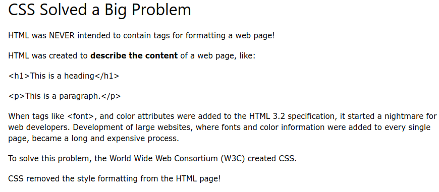
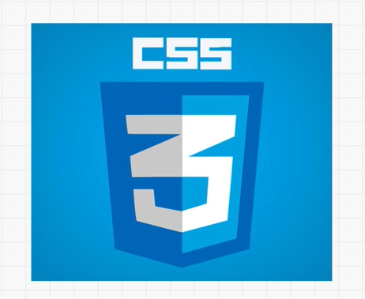

# 2. CSS
Created Friday 08 May 2020

FIXME CSS w2h

#### What is CSS?
* Cascading Style Sheets
* CSS describes how HTML elements are displayed on the **screen, paper or in other media**
* CSS saves a **lot of work**, it can control the layout of multiple web pages all at once.

#### CSS 3
* CSS3 is the latest version of CSS.

* In an ideal world, every browser has the same CSS behavior.
* CSS has some animations too.
* transition links to the pseudo classes.

#### Links
1. CSS Tricks - Alamnac and others
2. caniuse.com
3. Flexbox Froggy

CSS-Tricks Alamnac is an exhaustive property list.

