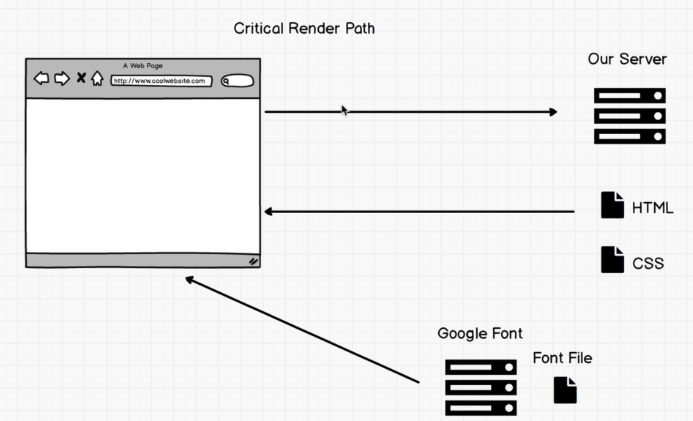
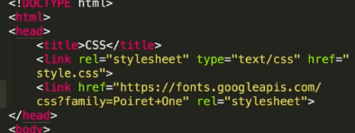
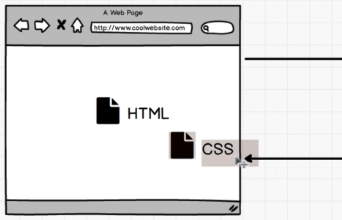
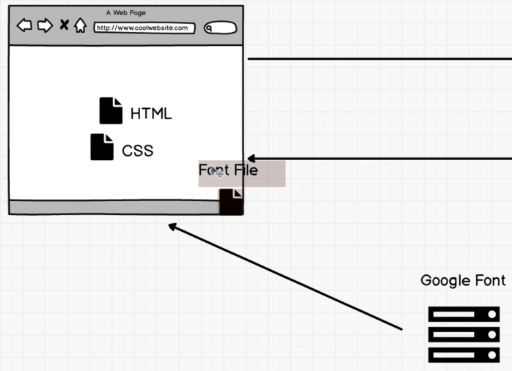

# 4. Critical Render Path
Created Tuesday 16 June 2020

- We always should know how things work underneath the hood to know how things happen.

Suppose we have the following setup:

We're using an external google-font style file.
The process:
1. HTML is sent - It requests for the CSS we built.

2. It then encounters the google-style sheet, and requests google.com.

- As this is being done, the first CSS file **could **be used - But this is not done, the items using CSS are not rendered until the CSS is there.
- CSS is a **render blocking file**
- We can avoid this by:
  1.  Have our own font files
  2.  Keeping the CSS file short - Minifying(removes all whitespaces, a one liner, used in js too)
