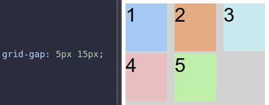

# 3. row and column gap
Created Thursday 03 September 2020

Use: specify the gap **between** rows and columns.
Just set them in the grid container

Properties and values (are sizes):
1. `grid-column-gap`
2. `grid-row-gap`
3. Shorthand `grid-gap`, applies same to both row/column.

