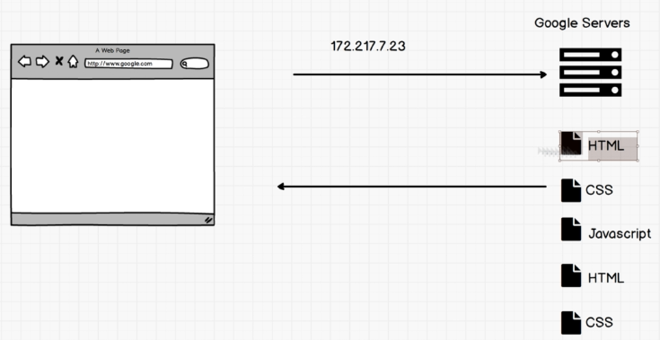
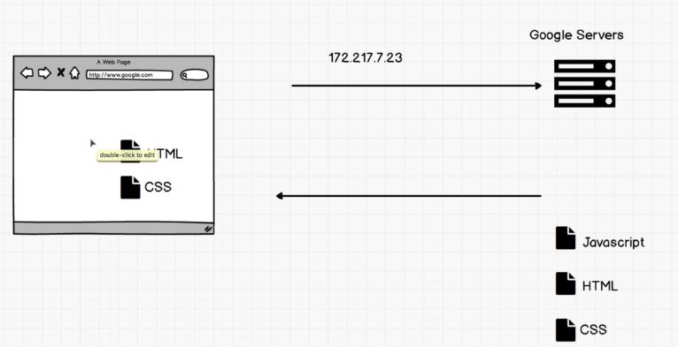
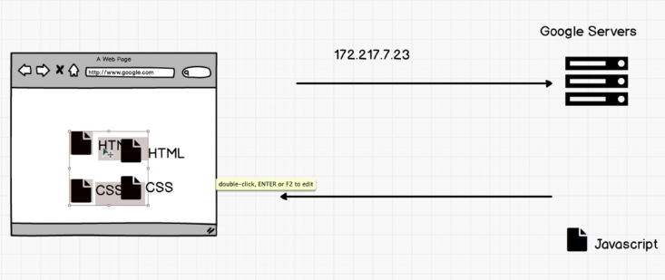
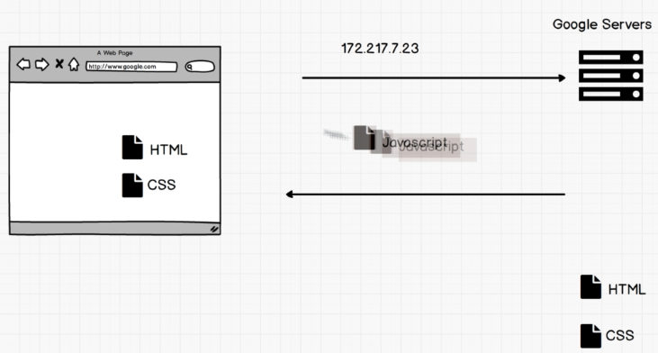

# 2. DOM Manipulation
Created Friday 10 July 2020

- Up until now, we've been writing HTML, CSS and using JS to control effects on the page, but not really.
- Using JS we can change everything from HTML elements, attributes to CSS effects on the page. This is truly a power.

### Browser powers of JS
- change any HTML element, attribute in a page.
- change any CSS styles on a page.
- remove existing HTML elements and attributes
- add new HTML elements and attributes
- JavaScript can create/edit/delete HTML *events *for any element in a page

## JS being the primary web lang
We could do some of the change to a website even without JS, just by using new HTML and CSS files.
e.g
- Option A
	Load the index.html 
	Need about.html, get it 
	
	get about.html 
	But this increases the latency(4x transit time) and therefore hampers user experience.
- Option B
	We just keep the instructions to change the html page, by just sending the JS. This reduces the data flow. No extra CSS or JS files are required.
	
	We can build fast and interactive sites (fast, so app?) this way. This is the key idea behind single page apps (React, Vue, Angular apps) - only an initial HTML file (aka shell) is sent. It has links for JS. The JS then creates all the DOM, and fetches any required CSS.
	

## Next
To do all this, we need understand two things:
1. DOM
2. JS engine
