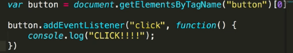

# 3. DOM events
Created Sunday 12 July 2020

- JS can be used to listen to events and do something. Events include hovering, clicking, writing, key-press, copy, paste etc.
- How to listen to events - attach an event listener(to some element).

## Add event listener - using HTML and JS
Many UI event handlers are available as attributes. The attribute value can be JS code.
```html
<script src="path-to-js"></script>
<button onsubmit="clickHandler(event)">Click me</button>

<button onsubmit="console.log('Hello')">Click me</button> <!-- this is fine too-->
```

```js
// attached JS file
function clickHandlerFunc (event) {}
```

Note: It's weird to pass the param in HTML `(event)` but it's needed and works.


## Add event listener - using JS only
```js
// way 2 - from JS alone
const uiNode = document.querySelector('...')
function clickHandlerFunc () {}
uiNode.addEventListener('click', clickHandlerFunc); 
// click is the event, the function will run when the event happens

// f recieves the "event" object automatically as first argument
// this object has the `target` (element that got triggered), and other keys and functions
```



## Some more events
1. `'click'`
2. `'keypress'`, event.which = 13 for enter(ASCII code)
3. `'mouseover'`
4. `'mouseout'`
5. `'input'` - triggered when value of the element changes

Note:
- The attribute versions (if using HTML and JS for event handling) usually have an `on` prefix.
- MAID - all eventListeners are in an **event-while** loop structure separate from the remaining code(which we assume has already run, because code is much **faster** than physical events)
- This is the reason why **caching** elements is so important, for relevant stuff, this makes it so easy and efficient.

### `event` param
The callback function can have a parameter which is set by JS once the event occurs. Some important attributes of this `event` parameter are:
1. `tagName` - returns tag name in all caps, a string.
2. `target` - returns the host object
3. `preventDefault`. Browsers usually a default behavior when an event occurs. Even if we our own event handler, the browser behavior will still take place. Sometimes, it's important to cancel the browser behavior. This can be done easily by calling `event.preventDefault()` before running any custom code in our function. 
	- Usage example - prevent navigation on form submit:
	```html
	<!-- script attaching code here-->
	
	<form onsubmit="formHandler(event)"></form>
	```
	```js
	function formHandler(event){
		event.preventDefault(); // prevents default "navigation" behavior of the browser

		// custom code
	}
	```
	- Usage example - prevent bubbling of click event:
	```js
	function myClickHandlerOnComplexNode(event) {
		event.stopPropagation(); // prevent imprecise register and cascade effects

		// custom code
	}
	```