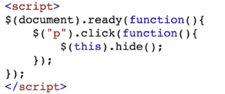
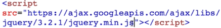
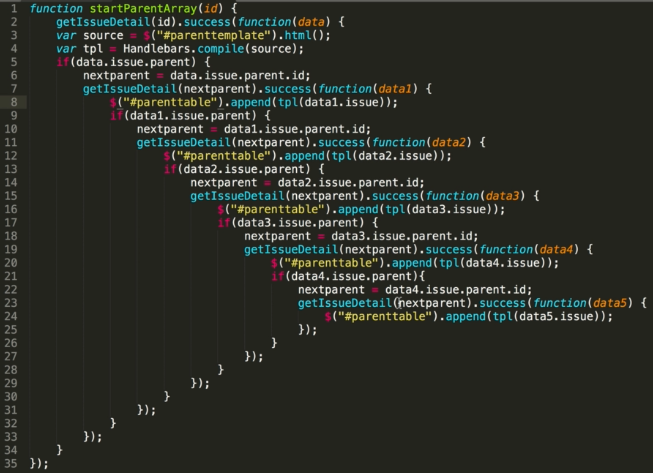

# 6. jQuery - trivia
Created Monday 13 July 2020

- What is jQuery - a DOM manipulation library.
- Why jQuery
  1.  Eliminates cross-browser incompatibilities.
  2.  It facilitates the separation of HTML and JS.
  3.  Extensibility - methods and elements can be reused.
  4.  Brevity - new kinds of events and other properties are available.
- How does it look?
  1.  jQuery is added inside a script tag.

Explanation: This is equivalent to setting the eventListener to the p tag.

2. For running jQuery, we need to attach the library.

- What's the issue with jQuery:
  1.  It made the code very imperative - the developer had to account for every action and the consequences, which includes the user's actions. For big websites, this becomes a huge mess.

**The pyramid of Doom**

---

- In a nutshell, we had HTML, CSS and JS. Then we had jQuery. As time progressed, people have made new things and much better libraries which have made working with JS much easier.
- Today - there are very few new projects which use jQuery.
- Developers who know only jQuery are not in high demand, and job postings are decreasing.

### What replaced jQuery?
- We'll use a better, open source library called React.js - It is very popular and efficient(computationally awa from a development perspective).
- It is declarative.
- TBH, it's not that React was meant to be a replacement for jQuery. It's just that JS first apps (JS manages the UI) became popular, and they of course had tools for DOM manipulation.
- In fact, nobody is using even the DOM API anymore. Code for apps written using React, Vue or Angular (JS SPA frameworks), don't have DOM API code and it's usually discouraged in such apps.