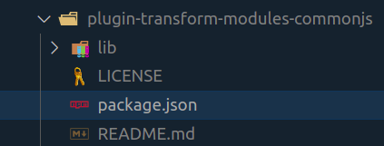

# 11. Modules in JS
Created Saturday 18 July 2020

## Why
For/To:
* Avoid namespace pollution
* Reuse of code
* Encapsulation
* Abstraction


## What is a module
A module is just a bit of code encapsulated in a file, and exported to another file.

## How
### 1. ES6 modules (this came later)
* Let us first see where are we now:
1. We had inline scripts in HTML - Reusability, pollution of the global namespace
2. We had script tags src - Order has to be decided beforehand(dependency resolution), we have to keep the script tags in all HTML files, global namespace is polluted.
3. Using IIFE, we have no pollution, but order is not important.
4. Browserify, before deployment, this app bundled all of the JS files into a single massive file called bundle.js. This way, we wouldn't have to worry about the namespace etc.
5. In ES6 using Webpack, we can use export and import - Makes code easy to maintain.
```js
	// js1
export const add = (a, b) => a+b;
//OR
export default function add(a, b){
	return a+b;
}

//js2
import {add} from './add'; // if normal 'export'
//OR
import add from './add'; // if 'export default'

import { add as k } from "./add"

import * as bundled from "./add"
```

### 2. Common JS modules (simplest)
The ES6 syntax has not been implemented in CommonJS (the standard for modules that Node follows). An **old** syntax is followed by Node.
* Source: A variable is exported by assigning it to `module.exports`.
* Destination: `require(path)` just returns the exported variable.
That's all.
```js
// Export - source
module.exports = 23;

// import
console.log(require(path)); // 23
let a = require(path);
console.log(a); // 230
```
Useful tip: If multiple things are passed, or if we need a tuple, an object may be exported.
```js
// Export - Source file
const largeNumber = 5;
module.exports = {
	largeNumber: largeNumber;
} // everything to be exported is sent as an object


// Import - Destination file
const { largeNumbers } = require("source_file_path");
const a = largeNumbers;
a // can be used
```
Useful: [CommonJS - what, why and how](https://medium.com/@cgcrutch18/commonjs-what-why-and-how-64ed9f31aa46)

## If CommonJS is what JS used, how does React use ES6 syntax?
* Browsers don't understand CommonJS, as they're not Node.
* Consequently, apps written in Node.js's JavaScript needs to be transpiled to vanilla JS.
* This is where compilers like [Babel](2_ES5_and_ES6.md) come in: they can receieve input in any way.
* And ES6 is set as input, and is compiled to CommonJS.


Evidence: create-react-app installs [babel-plugin-transform-modules-commonjs](https://babeljs.io/docs/en/babel-plugin-transform-modules-commonjs).


