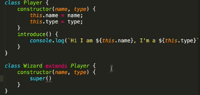

# 4. Inheritance
Created Thursday 25 March 2021

4. **Inheritance** - Simple.
   - Suppose we are making a MOBA. Our players can be a Wizard, Healer, etc.
   - How to handle object creation, and then allot them their type.

_Approach_ - Make a Player class, having a function with a switch(type_input) which creates the required object, and also adds Player properties to it.

- This approach is good, but it has many practical and theoretic problems, which are solved using inheritance:
  1.  We have two classes, Player and Wizard(which contains everything from Player. This is **hampering extensibility** - what if we had a Wizard which was female, we'd have to work on Player, Wizard and the new female class. The code would be very **clumsy**. Code reuse is easy.
  2.  It makes code **maintainable **- Changing the superclass, will reflect the change in all the subclasses, if such a change is ever required.
- All this is implemented and the simplified approach is called inheritance. It can be tricky, but is way better than the manual way.
- Syntax: Use **extends** keyword.

Note:

- Classes are nothing but syntactic sugar introduced from ES6 2015
- All OOPS syntax is a subset of Java syntax.
- No access modifiers exist in Javascript
